# ⚔ Terraria Hub

A self-hosted, multi-user tModLoader server management panel. Each user gets their own login account, isolated worlds, and per-world Docker container. An admin panel handles user management across the entire installation. Tunnelling via [playit.gg](https://playit.gg) is supported per world so players can connect without port-forwarding.

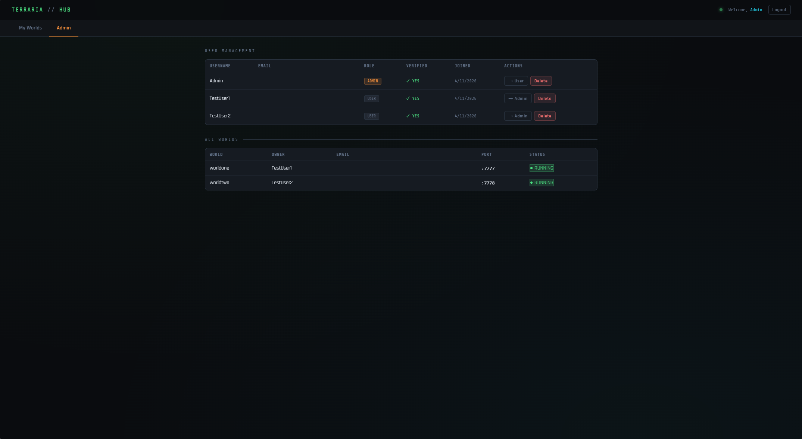

---

## Features

- **Multi-user accounts** — JWT + bcrypt authentication, email verification, password reset with token expiry
- **Per-user world isolation** — every world lives under the authenticated user's ID; no user can touch another's worlds
- **Per-world Docker containers** — each tModLoader server runs in its own isolated container using [`jacobsmile/tmodloader1.4`](https://hub.docker.com/r/jacobsmile/tmodloader1.4)
- **Automatic port allocation** — game ports assigned from a configurable range (default `7777–7900`), tracked in SQLite
- **Steam Workshop mod management** — add mods by Workshop URL or ID, set server/client/both scope, saved per world
- **Per-world playit.gg tunnels** — optional public tunnel per world using your own secret key; no router port-forward needed
- **Bootstrap admin** — first-start creates the admin account automatically from `ADMIN_EMAIL` + `ADMIN_TEMP_PASS`
- **Admin panel** — view all users and worlds, promote/demote roles, manually verify accounts, delete users
- **World settings** — max players, password, world size, difficulty, seed, autosave interval, shutdown message
- **Live log viewer** — tails Docker container logs with 4-second polling directly in the browser
- **NAS backup script** — optional `backup.sh` + cron job generated by the installer for rsync to a Synology or similar

---

## Screenshots

### Authentication

Users register with a username, email, and password. A verification email is sent before the account can be used. Existing users log in with email and password, with a forgot-password flow that sends a reset link with a one-hour expiry.

<p float="left">
  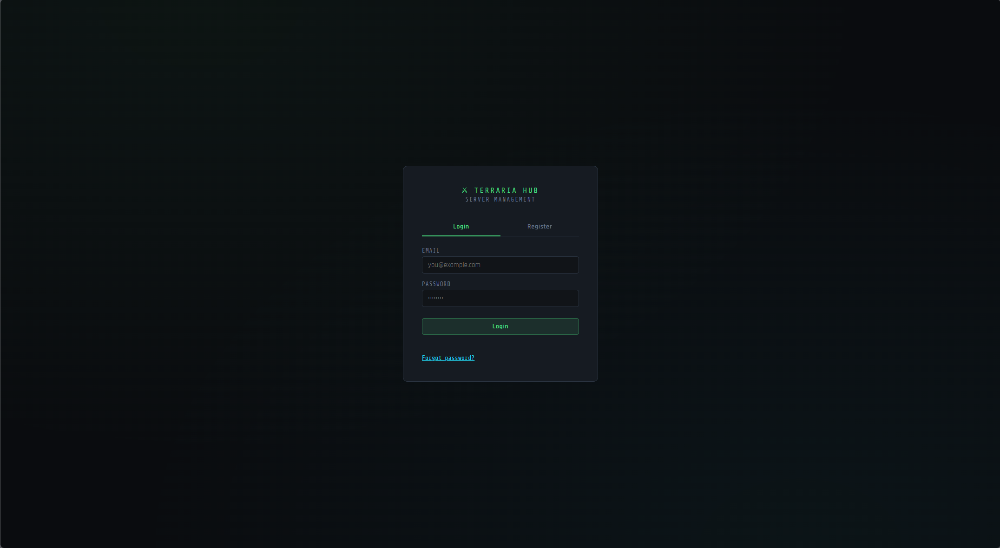
  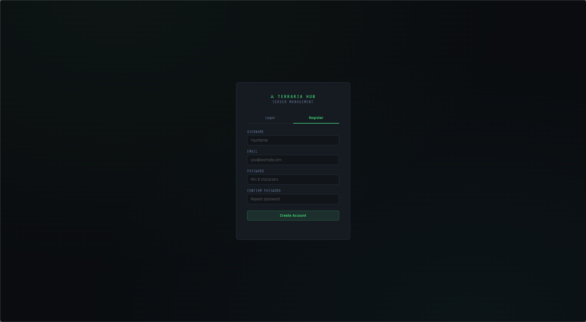
</p>

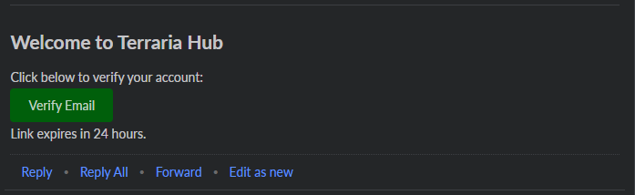

---

### Dashboard

After logging in, each user sees only their own worlds. The global dot in the top-right turns green when any world is running. New worlds are created with the **+ New World** card.

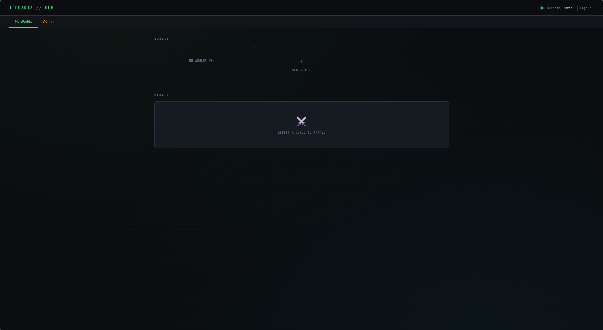

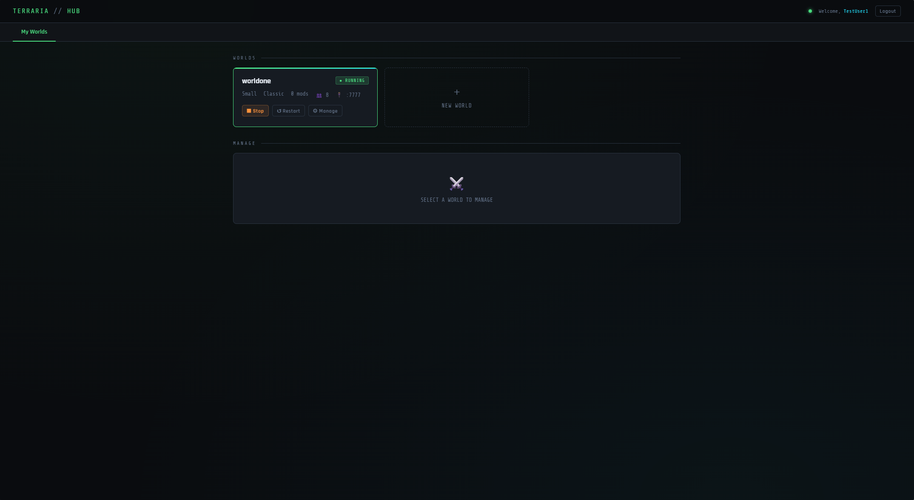

---

### World Settings

Each world has fully configurable settings. The game port is auto-assigned from the configured range and shown read-only. An optional per-world playit.gg secret key launches a dedicated public tunnel for that world without affecting others.

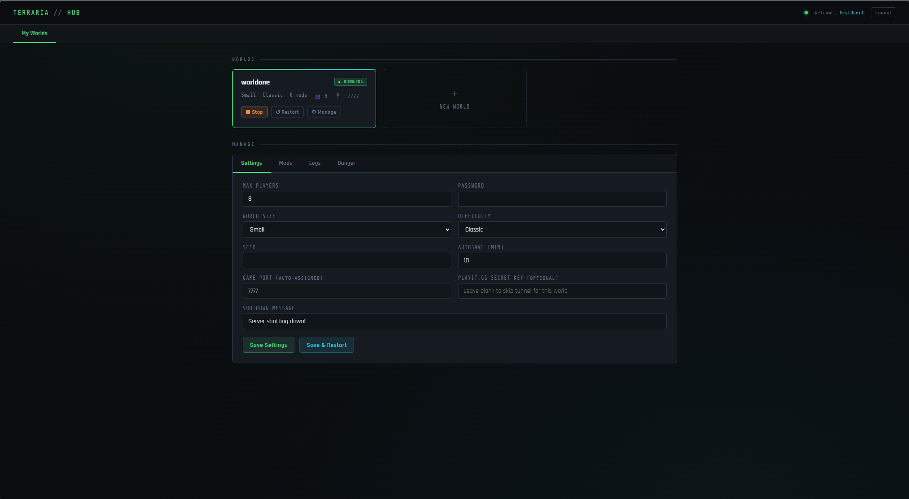

---

### Steam Workshop Mods

Paste any Steam Workshop URL and Terraria Hub looks up the mod name automatically via the Steam API. Each mod can be set as server-side, client-side, or both. The mod list is stored per world and applied on next start.

<p float="left">
  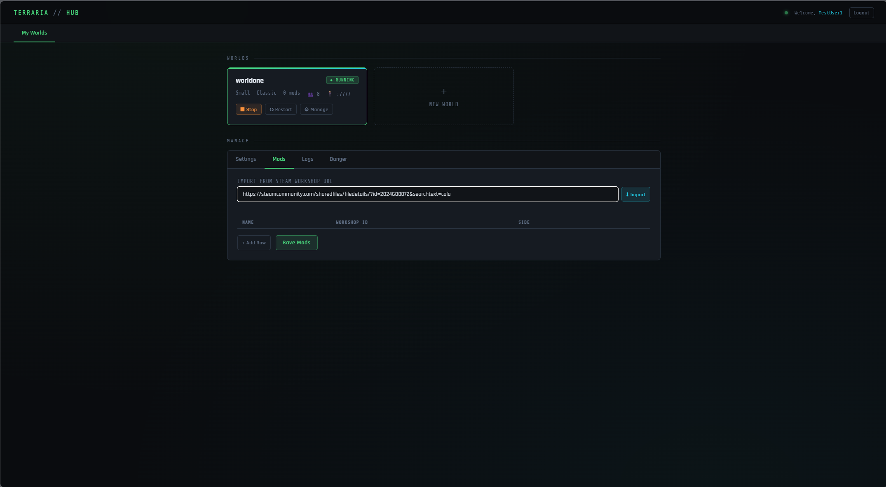
  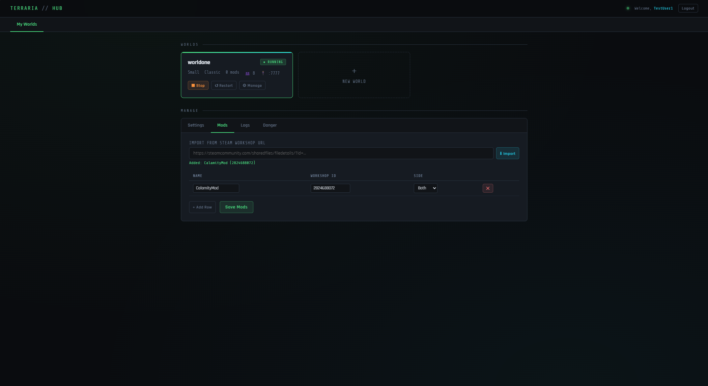
</p>

---

### Live Log Viewer

The Logs tab tails the Docker container output and refreshes every 4 seconds. The start overlay polls the same endpoint while a world is generating and dismisses automatically when `Server started` appears.

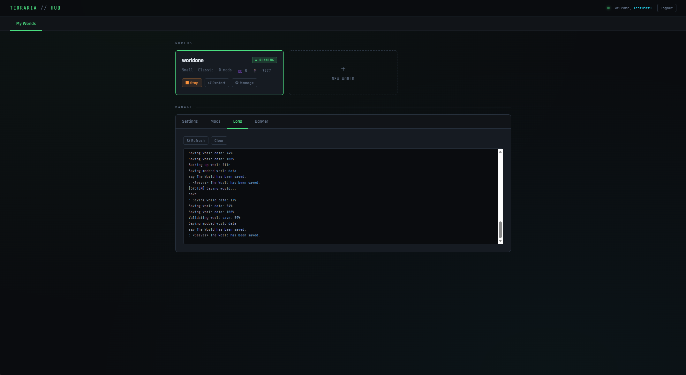

---

### Admin Panel

The Admin tab is only visible to accounts with the `admin` role. It shows every registered user with role, verification status, join date, and action buttons. Below the user table, every world across all accounts is listed with its owner, port, and live running status.


---

### In-Game Connection

Connect from the tModLoader client using the server IP and the port shown on the world card. Each world is a completely separate tModLoader server with its own terrain, progress, and player data.

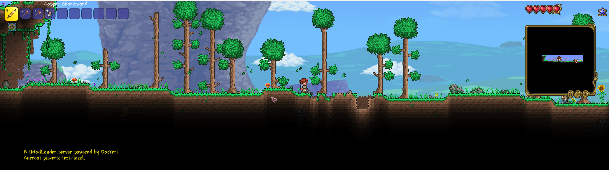

---

### Docker Architecture

Three containers running simultaneously — the panel container managing everything, and one dedicated container per active world, each with its own isolated port mapping.

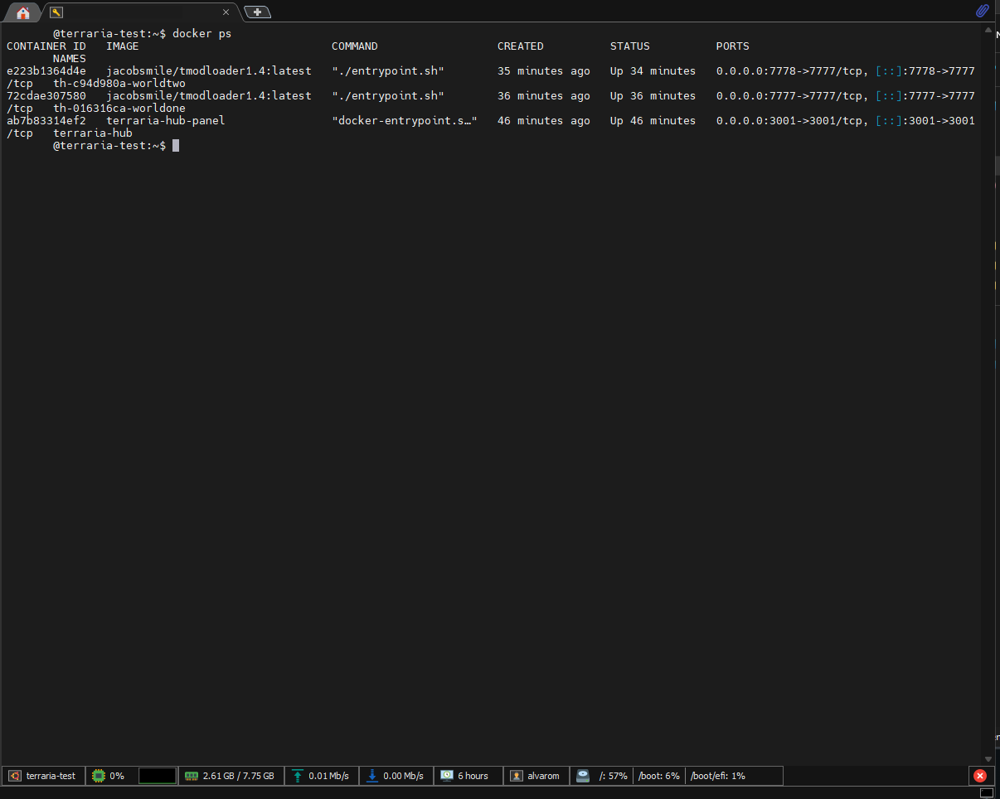

---

## Requirements

- Linux host (Ubuntu 20.04+, Debian 11+, Fedora 37+, Arch)
- [Docker Engine](https://docs.docker.com/engine/install/) 24+
- [Docker Compose](https://docs.docker.com/compose/install/) v2 plugin (or standalone `docker-compose`)
- `git`, `curl`, `openssl` (standard on most distros)
- An SMTP account for sending verification and password reset emails
- Outbound internet access (to pull the tModLoader image and Steam Workshop mods)

---

## Quick Install

```bash
bash <(curl -fsSL https://raw.githubusercontent.com/arsin305/terraria-hub/main/install.sh)
```

The installer will prompt you for:

| Prompt | Description |
|--------|-------------|
| Linux username | Used to construct the default install path |
| Install directory | Where the repo is cloned (default: `~/docker/terraria-hub`) |
| Panel port | HTTP port for the web UI (default: `3001`) |
| Host IP | Included in email links |
| Admin email | Used to create the bootstrap admin account |
| SMTP credentials | Host, port, username, password, from address |
| playit.gg secret key | Optional — skipped if left blank |

At the end the installer prints a one-time admin password. **Save it before closing the terminal** — it is not shown again.

---

## Manual Install

```bash
git clone https://github.com/arsin305/terraria-hub.git ~/docker/terraria-hub
cd ~/docker/terraria-hub

# Copy and fill in the environment file
cp .env.example .env
nano .env

# Create runtime directories
mkdir -p data worlds

# Build and start
docker compose up -d --build
```

---

## Configuration

All configuration is through the `.env` file. See [`.env.example`](.env.example) for a fully documented template.

| Variable | Required | Default | Description |
|----------|----------|---------|-------------|
| `JWT_SECRET` | **Yes** | — | Random hex string for signing JWTs. **Must be set — server refuses to start without it.** |
| `PANEL_PORT` | No | `3001` | Port the web panel listens on |
| `ADMIN_EMAIL` | **Yes** | — | Email address for the bootstrap admin account |
| `ADMIN_TEMP_PASS` | **Yes** | — | Temporary password set on first start. Change it immediately after login. |
| `HOST_IP` | **Yes** | — | IP or hostname used in verification/reset email links |
| `WORLDS_DIR` | No | `/worlds` | World data path *inside* the panel container |
| `HOST_WORLDS_DIR` | **Yes** | — | World data path on the *host* — Docker bind-mounts this into each world container |
| `TMOD_IMAGE` | No | `jacobsmile/tmodloader1.4:latest` | tModLoader Docker image |
| `PORT_BASE` | No | `7777` | First game port in the allocation range |
| `PORT_MAX` | No | `7900` | Last game port in the allocation range |
| `SMTP_HOST` | **Yes** | — | SMTP server hostname |
| `SMTP_PORT` | No | `587` | SMTP port (STARTTLS) |
| `SMTP_USER` | **Yes** | — | SMTP login username |
| `SMTP_PASS` | **Yes** | — | SMTP password or app-specific password |
| `SMTP_FROM` | No | `SMTP_USER` | From address in outgoing emails |

---

## Directory Layout

```
terraria-hub/
├── install.sh              # Interactive installer
├── uninstall.sh            # Removal script (3 modes: full / keep data / containers only)
├── docker-compose.yml      # Panel + optional playit.gg service
├── .env.example            # Documented template
├── docs/
│   └── screenshots/        # README images
├── data/
│   └── hub.db              # SQLite database (users, sessions, port allocations)
├── worlds/
│   └── <user-id>/
│       └── <world-name>/
│           ├── settings.json
│           ├── mods-config.json
│           └── data/tModLoader/...
└── panel/
    ├── Dockerfile
    ├── package.json
    ├── app.js              # Express API server
    └── public/
        └── index.html      # Single-page frontend
```

---

## Useful Commands

```bash
# View panel logs
docker logs -f terraria-hub

# View a specific world container's logs
docker logs -f th-<shortUserId>-<worldname>

# Restart the panel
cd ~/docker/terraria-hub && docker compose restart

# Stop everything
cd ~/docker/terraria-hub && docker compose down

# Rebuild after a git pull
cd ~/docker/terraria-hub && docker compose up -d --build

# Open a shell inside the panel container
docker exec -it terraria-hub sh
```

---

## Security Notes

### Docker socket access
The panel container mounts `/var/run/docker.sock` so it can start and stop world containers. This gives the panel **root-equivalent access to the host**. Only run this on a machine you control and trust. Do not expose the panel port directly to the public internet without a reverse proxy and TLS.

### Recommended hardening
- Put the panel behind a reverse proxy (nginx, Caddy, Traefik) with HTTPS
- Restrict panel port access to your LAN with a firewall rule (`ufw`, `firewalld`)
- Use a strong, unique `JWT_SECRET` (the installer generates one automatically with `openssl rand -hex 32`)
- Change the admin password immediately after first login

---

## Uninstall

```bash
bash ~/docker/terraria-hub/uninstall.sh
```

Three removal modes:
1. **Everything** — containers, images, all world data, install directory
2. **Containers & images only** — keeps world saves, database, and `.env` (safe for reinstall)
3. **Containers only** — leaves everything intact; restart with `docker compose up -d --build`

---

## License

MIT — see [LICENSE](LICENSE)
